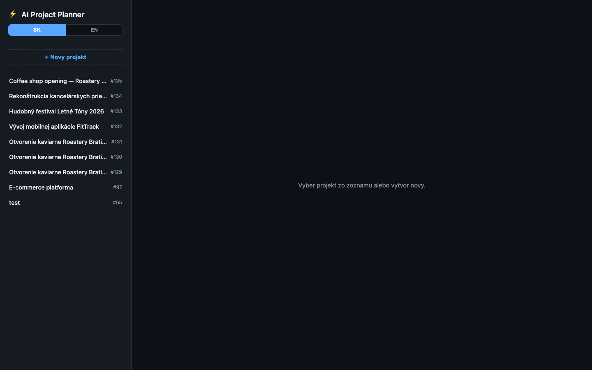
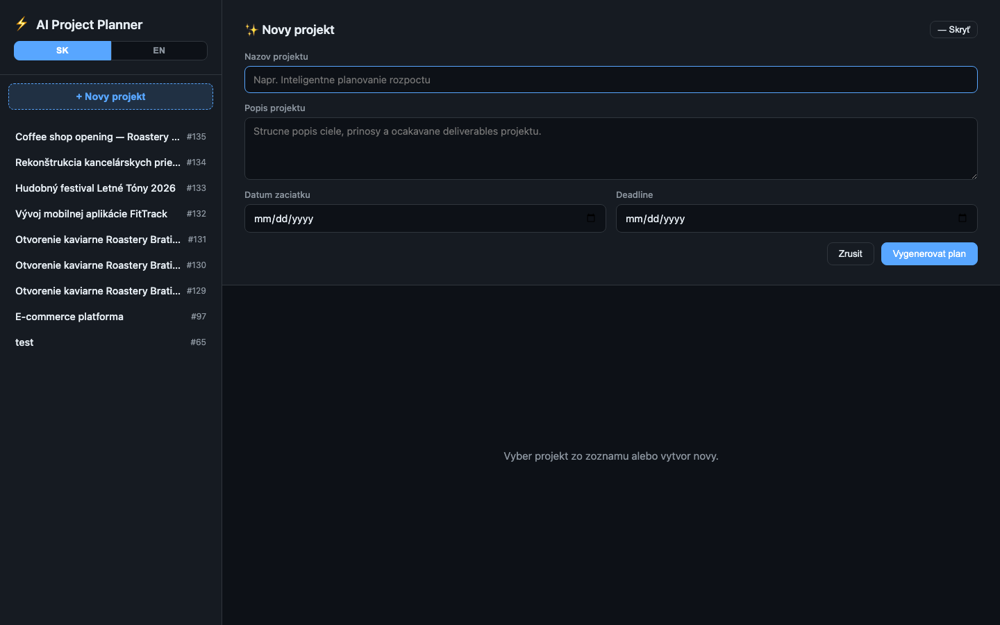
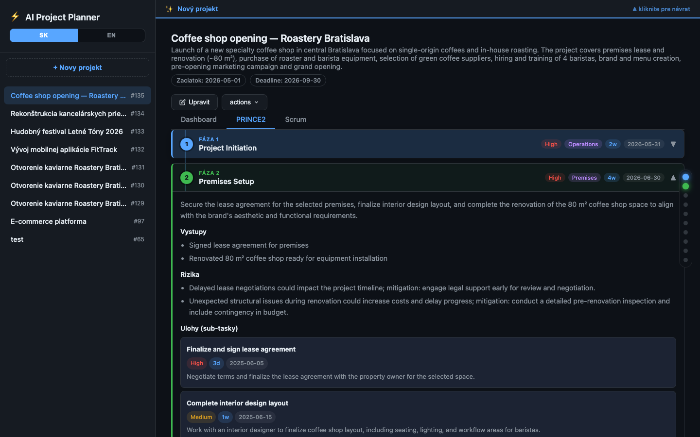
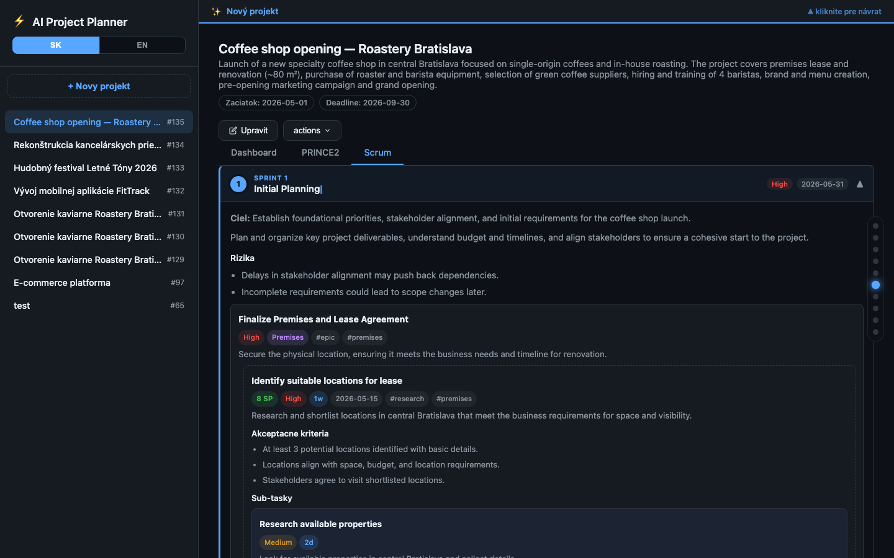
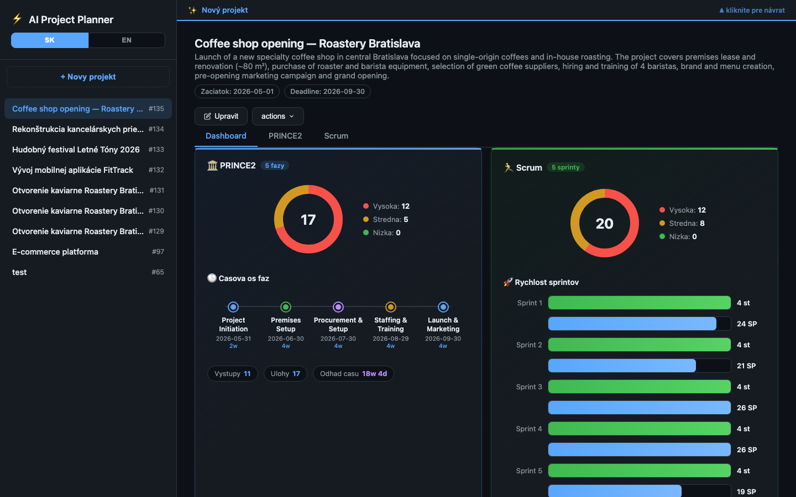
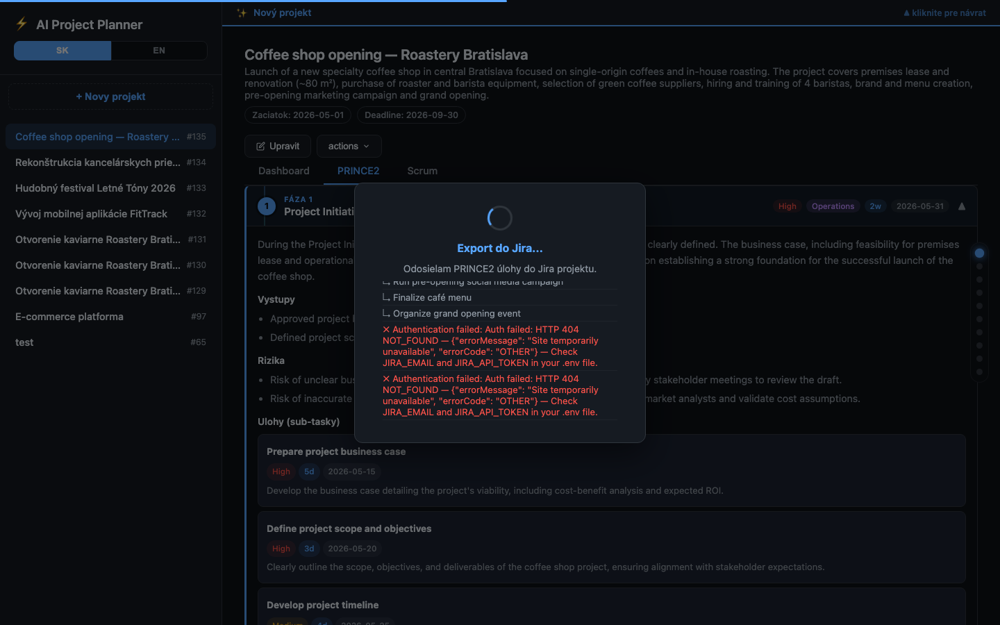

# ⚡ AI Project Planner

> **Bakalárska práca** — Paneurópska vysoká škola, Fakulta informatiky  
> **Autor:** Kirill Porokh  
> **Vedúci práce:** doc. RNDr. Eugen Ružický, CSc.  
> **Akademický rok:** 2025/2026

---

Webová aplikácia, ktorá pomocou **Azure OpenAI (GPT-4o)** automaticky generuje projektové plány podľa metodológií **PRINCE2** a **Scrum**, umožňuje ich interaktívne editovanie a exportuje úlohy priamo do **Atlassian Jira Cloud**.

---

## Ukážky — Príloha B

| | |
|:---:|:---:|
| **B.1 — Hlavná obrazovka** | **B.2 — Formulár nového projektu** |
|  |  |
| **B.3 — Vygenerovaný PRINCE2 plán** | **B.4 — Vygenerovaný Scrum plán** |
|  |  |
| **B.5 — Analytický dashboard** | **B.6 — Export do Atlassian Jira** |
|  |  |

---

## Funkcie

| Oblasť | Popis |
|---|---|
| 🤖 **AI generovanie** | Dual-prompt: PRINCE2 (fázy → úlohy → výstupy → riziká) + Scrum (sprinty → epics → stories → sub-tasky), SK/EN |
| 📊 **Dashboard** | Porovnávací dashboard PRINCE2 vs Scrum — donut grafy, časová os fáz, sprint velocity |
| ✏️ **Inline editovanie** | Editácia každého poľa priamo v UI (name, description, priority, estimate, story points) |
| 🔍 **Validácia** | Frontend + backend validácia pred exportom (štruktúra XML, povinné polia) |
| 📤 **Jira export** | Export celej hierarchie do Jira Cloud (Task → Sub-task) s ADF opisom, prioritou, due date |
| 🔌 **Jira diagnostika** | Tlačidlo „Test Jira" — overí autentifikáciu pred exportom |
| 🌐 **i18n** | Prepínanie SK / EN v reálnom čase |
| 💾 **Perzistencia** | H2 file-based DB, automatická migrácia schémy |
| 📚 **Swagger UI** | OpenAPI dokumentácia na `/swagger-ui.html` |

---

## Tech Stack

```
Backend:   Java 17 · Spring Boot 3.x · Spring WebFlux · JPA / H2
Frontend:  Vanilla JS (ES2022) · CSS custom properties · GSAP 3.12
AI:        Azure OpenAI — GPT-4o · max 8 000 tokenov na volanie
Jira:      Cloud REST API v3 · ADF description format
Docs:      SpringDoc OpenAPI (Swagger UI)
```

---

## Spustenie

### 1. Vytvor `.env` v koreňovom adresári

```bash
AZURE_OPENAI_ENDPOINT=https://your-resource.openai.azure.com/
AZURE_OPENAI_KEY=your-api-key
AZURE_OPENAI_DEPLOYMENT=gpt-4o

JIRA_SITE_URL=https://your-org.atlassian.net
JIRA_EMAIL=your-email@example.com
JIRA_API_TOKEN=your-jira-api-token
JIRA_PROJECT_KEY=AIP
JIRA_FIELD_STORY_POINTS=customfield_10016
```

### 2. Spusti aplikáciu

```bash
set -a && source .env && set +a
mvn spring-boot:run
```

Aplikácia beží na **[http://localhost:8080](http://localhost:8080)**

### 3. Swagger UI

```
http://localhost:8080/swagger-ui.html
```

---

## Štruktúra projektu

```
src/
├── main/java/org/example/
│   ├── Controller/        # REST endpointy (ChatController, ProjectController)
│   ├── Service/           # Biznis logika (OpenAiService, ProjectService)
│   ├── Model/             # JPA entity (Project)
│   └── Repository/        # Spring Data repozitáre
└── main/resources/
    ├── static/            # Frontend (index.html, CSS, JS)
    └── application.yml    # Konfigurácia Spring Boot
screenshots/
└── priloha-b/             # Snímky obrazoviek — Príloha B bakalárskej práce
```

---

## Prílohy bakalárskej práce

| Príloha | Obsah |
|---|---|
| **A** | Zdrojový kód aplikácie (tento repozitár) |
| **B** | Snímky obrazoviek aplikácie → `screenshots/priloha-b/` |

---

*Bakalárska práca, 2025/2026 · Paneurópska vysoká škola · Kirill Porokh*
